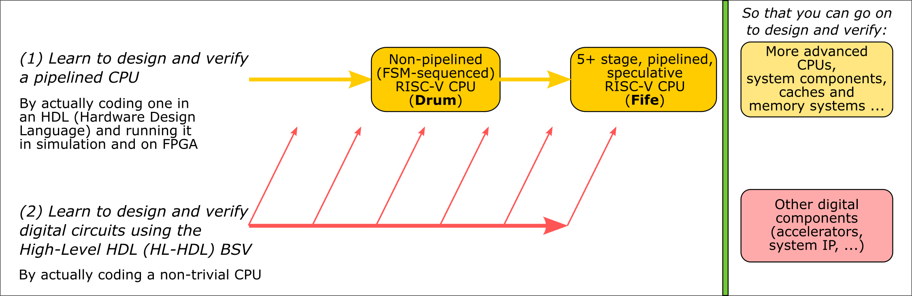
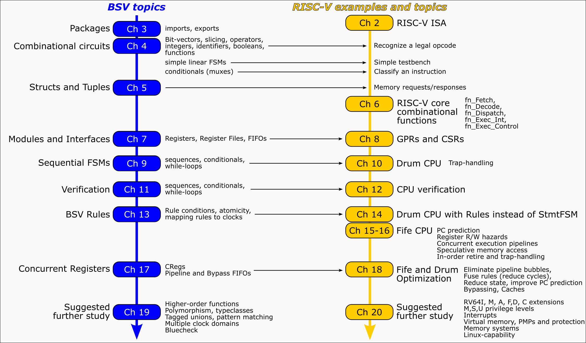

= Learn Bluespec and RISC-V Design
(c) Rishiyur S. Nikhil, Bluespec, Inc. 2024
:revnumber: v0.980
:revdate: 2024-08-07.A
:sectnums:
:toc:
:toclevels: 3
:toc-title: Contents
:keywords: Bluespec, B-Lang, BSV, BH, RISC-V, Pipelined CPU, HDL, HLHDL, High Level Hardware Design Language, Fife, Drum

// ****************************************************************

[NOTE]
====
Please only submit "Issues", and not PRs, to this repo.  This repo is
not a development repo, just the place where we assemble
"distributions" of the book, code, and courseware which are developed
elsewhere (hence PRs here would not be actionable).
====

[NOTE]
====
This document's source is `README.adoc` and can be read as-is
in a text-editor or terminal.  It can also be processed with the free,
open-source `asciidoctor` tool into `README.html` and viewed in
any browser.
====

// ****************************************************************

== Introduction

This is a pre-release of free and open-source materials for a course:
"Learn RISC-V CPU Implementation and BSV", suitable for self-study or
classroom use.  The goals for the course are:

Outline of repository contents:
----
.
├── Book_BLang_RISCV.pdf
├── Code
│   ├── src_*
│   └── Doc/Build_and_Run_Guide.adoc
├── Slides
└── Exercises
----

`Book_BLang_RISCV.pdf`: Textbook (about 320 pages).

[WARNING]
====

Apparently the PDF does not render correctly on GitHub in some
browsers ("Error rendering embedded code; Invalid PDF"), e.g.,
DuckDuckGo on MacOS Ventura).

It does render correctly in other browsers (e.g., Safari and Firefox on MacOS Ventura).

It does render correctly if you download it use a PDF viewer (e.g., Preview on MacOS Ventura).

====

`Code/`: Full source codes for Drum and Fife, along with Makefiles to
build and run (Verilog simulation).  `Build_and_Run_Guide.adoc`
explains how to compile and run, using free and open-source tools
(_bsc_ compiler to compile BSV to Verilog, and _Verilator_ to simulate
the Verilog).  [Coming: separate documentation on how to run Drum and
Fife on FPGAs on Amazon AWS F1 instances.]

`Slides/`: Lecture slides for Chapters 1-18 (no slides for Chapters 19-20)

`Exercises/`: Code for exercises in book appendix ``Exercises''

// ****************************************************************

== Installing prerequisite software tools

To compile and run BSV code in simulation (Drum, Fife, exercises) you
will need the _bsc_ compiler (compiles BSV source codes into a Bluesim
simulation executable, and/or also into Verilog).  If you want to
simulate the generated Verilog (instead of using Bluesim), we
recommend using Verilator.  Please see: +
`Doc/Installing_bsc_Verilator_etc.{adoc,html}` +
for installation guidance.

// ****************************************************************

== About the pedagogic approach

We describe the design of two RISC-V CPU implementations, in this order:

* *Drum*, an "FSM" implementation, which almost looks like a software
  RISC-V simulator written in C, except that it is fully synthesizable
  and runnable on FPGAs.

* *Fife*, a 5+ stage, mostly in-order, pipelined implementation,
  including simple branch prediction, scoreboarding, in-order
  retirement, and speculative STOREs with a store-buffer.

The two implementations share _all_ the functional parts of RISC-V
code, which are covered in the first part of the book, with *Drum*.
By the time we reach the second part of the book, on *Fife*, we focus
purely on pipelining questions, since all RISC-V-specific semantics
have already been covered with *Drum*.

We interleave RISC-V and BSV topics in an incremental and mutually
reinforcing way, and describe the full design and verification process
and the code in detail.  We hope to avoid steep learning curves for
BSV and for RISC-V.  This diagram shows the interplay between BSV and
RISC-V chapters:

The exercises in `Exercises/` are synchronized with the Book, in which
there are small sections titled **Exercises**, each pointing to a
particular `Exercises/` sub-directory.  In each such sub-directory
there is a README describing the exercise in more detail.  The first
task in each README is normally just to run the code provided for that
exercise, which should compile and run immediately with the provided
Makefile (this can also be demo'd during a lecture).  The README then
has suggestions for variations for students to try on their own.

*Drum* and *Fife* implement the "RV32I" subset of the RISC-V
Unprivileged ISA, plus a few features from the Privileged
specification sufficient to to handle illegal instructions and other
traps, and interrupts.  This is adequate for small embedded systems.
The book discusses how to extend *Drum* and *Fife* into 64-bit
Linux-capability.

We welcome feedback about your learning experience.

// ****************************************************************

== About RISC-V and BSV

RISC-V is an open-standard ISA (Instruction-Set Architecture).  ISA
specification documents can be found at
https://riscv.org/technical/specifications/[].  The site
https://riscv.org/[] also contains much additional useful material, in
particular information on GNU compilation/debugging tools gcc, gdb,
etc.

Bluespec BSV is a free, open-source HLHDL (High-Level Hardware Design
Language), a significant improvement in expressive power and
simplicity compared to Verilog/SystemVerilog/VHDL.  Its free,
open-source compiler is available at:
link:https://github.com/B-Lang-org/bsc[].  An appendix in the book
discusses "Why BSV?" in more detail.

// ****************************************************************

== Status (as of August 7, 2024)

Here, ``complete'' means full first draft.  Once each component is
complete, we expect a final, complete, careful editing pass for
smoothing and cleanup.

* *Book*: complete except for the final two chapters (19, 20) which
  contain suggestions for future study of BSV and future study of
  RISC-V, respectively.

* *Code*: Drum and Fife codes complete.
+
Tested on ISA tests from
https://github.com/riscv-software-src/riscv-tests[].  Drum and Fife
PASS all 39 `rv32mi-p-...` tests, and 10/11 of the `rv32mi-p-...`
tests (we ignore the 11th test, `rv32mi-p-breakpoint`, because it
requires Debug Module CSRs which are not currently implented in Drum
and Fife).

* *Slides* (for lectures): complete.

* *Exercises* (for labs): In progress; expected completion by end of
  August 2024.

This repository is expected to be updated frequently through the end
of August 2024 as we complete the few remaining materials.  When you
clone it, you may wish to keep track of commit/date so you can revert
to that version if needed.

// ****************************************************************
